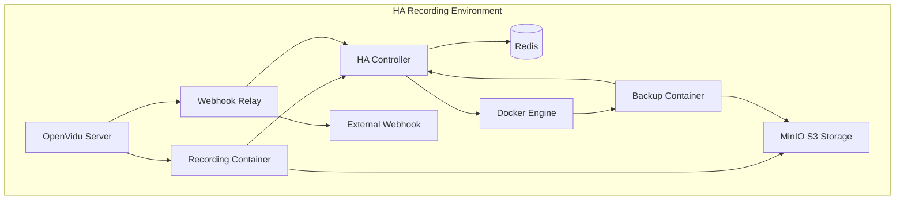
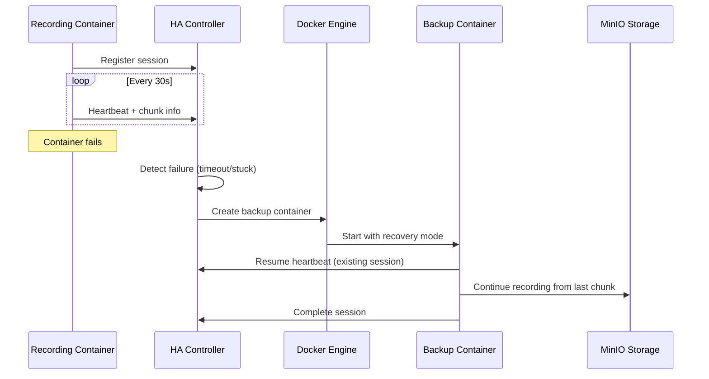
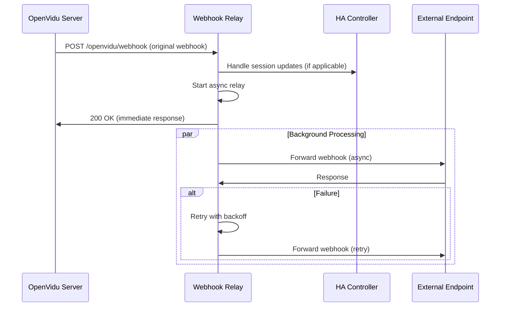

# OpenVidu HA Recorder - High Availability Recording Solution

[](https://www.docker.com/)
[](https://spring.io/projects/spring-boot)
[](https://redis.io/)
[](https://openvidu.io/)

A comprehensive **High Availability (HA) recording solution** for OpenVidu that provides intelligent failover, real-time chunk tracking, and centralized session management. This solution replaces standard OpenVidu recording containers with enhanced NaevaTec versions that support HA functionality, Docker-in-Docker failover, and webhook relay capabilities.

## 🚀 **For the Impatient**

Get up and running in 5 minutes:

```bash
# 1. Clone and setup
git clone https://github.com/naevatec/openvidu-ha-recorder.git
cd openvidu-ha-recorder

# 2. Configure environment (update IP address)
cp .env.example .env
# Edit .env: Set HA_AWS_S3_SERVICE_ENDPOINT to your machine's IP
vim .env  # Update: HA_AWS_S3_SERVICE_ENDPOINT=http://YOUR_IP:9000

# 3. Deploy everything
./replace-openvidu-image.sh 2.31.0

# 4. Test it works
curl -u recorder:rec0rd3r_2024! http://localhost:8080/api/sessions/health

# 5. Access Swagger UI (development)
open http://localhost:8080/swagger-ui.html
```

**✅ Done!** Your HA recording system is ready with failover, chunk tracking, and webhook relay.

---

## 📋 Table of Contents

- [🎯 Overview](#-overview)
- [🏗️ Architecture](#️-architecture)
- [⚡ Quick Start](#-quick-start)
- [📁 Project Structure](#-project-structure)
- [🔧 Configuration](#-configuration)
- [🎮 Usage](#-usage)
- [🔄 HA Failover System](#-ha-failover-system)
- [📡 API Reference](#-api-reference)
- [🌐 Webhook Relay](#-webhook-relay)
- [🧪 Testing](#-testing)
- [🔒 Security](#-security)
- [🐛 Troubleshooting](#-troubleshooting)
- [🤝 Contributing](#-contributing)

---

## 🎯 Overview

### What is OpenVidu HA Recorder?

OpenVidu HA Recorder is a **production-ready High Availability solution** that enhances OpenVidu's recording capabilities with:

- **🔄 Intelligent Failover**: Automatic backup container deployment when recordings fail
- **📊 Real-time Monitoring**: Chunk-level progress tracking and heartbeat monitoring  
- **🎛️ Centralized Management**: SpringBoot-based HA Controller with REST API
- **🌐 Webhook Relay**: High-performance async webhook forwarding with retry logic
- **🐳 Docker-in-Docker**: Seamless container lifecycle management for failover
- **📈 Production Monitoring**: Comprehensive metrics, health checks, and observability

### Key Problems Solved

| Problem | Solution |
|---------|----------|
| **Recording Container Failures** | Automatic failover with backup containers |
| **Lost Recording Sessions** | Redis-based session persistence and recovery |
| **Manual Failover Management** | Automated detection and container deployment |
| **No Progress Visibility** | Real-time chunk tracking and progress monitoring |
| **Webhook Processing Issues** | Dedicated relay service with retry logic |
| **Operational Complexity** | Centralized management through REST API |

### Use Cases

- **Enterprise OpenVidu Deployments**: Mission-critical recording with zero tolerance for failure
- **High-Volume Recording**: Multiple concurrent sessions with automated failover
- **Cloud Environments**: Kubernetes-ready with support for container orchestration
- **Development Teams**: Complete development environment with MinIO S3 compatibility
- **Monitoring Integration**: REST API and webhook integration for external systems

---

## 🏗️ Architecture

### System Components



### Core Services

#### 🎛️ **HA Controller (SpringBoot)**
- **Purpose**: Centralized session management and failover orchestration
- **Technology**: SpringBoot 3.5.4 + Java 21, Redis for persistence
- **Features**: 
  - REST API for session lifecycle management
  - Real-time chunk tracking with heartbeat monitoring
  - Automated session cleanup and orphan detection
  - Docker-in-Docker container management
  - Swagger API documentation (profile-based)
  - HTTP Basic Authentication

#### 🎬 **Enhanced Recording Container**
- **Purpose**: Custom OpenVidu recording with HA integration
- **Technology**: Ubuntu 24.04, Chrome, FFmpeg, custom scripts
- **Features**:
  - Integrated HA session management scripts
  - Real-time chunk progress monitoring
  - 30-second optimized container shutdown
  - Emergency nuclear cleanup for process termination
  - Recovery mode support for failover scenarios

#### 🌐 **Webhook Relay Service**
- **Purpose**: High-performance OpenVidu webhook forwarding
- **Technology**: Async processing with dedicated thread pools
- **Features**:
  - Configurable target endpoints with custom headers
  - Retry logic with exponential backoff
  - Multi-method support (GET, POST, PUT, PATCH, DELETE)
  - Performance metrics and monitoring

#### 🐳 **Docker-in-Docker Failover**
- **Purpose**: Automatic backup container management
- **Technology**: Docker Java client with HttpClient5 transport
- **Features**:
  - Lazy initialization to avoid startup issues
  - Failed session detection with timeout monitoring
  - Container lifecycle management (create, start, stop, cleanup)
  - Network integration and environment variable management

#### 🗄️ **Supporting Infrastructure**
- **Redis**: Session data persistence and real-time state management
- **MinIO**: S3-compatible storage for development and testing
- **Docker Compose**: Multi-service orchestration with profiles

### Data Flow

#### Normal Recording Flow
```
1. OpenVidu → Recording Container (start recording)
2. Recording Container → HA Controller (register session)  
3. Recording Container → HA Controller (heartbeat + chunk info every 30s)
4. Recording Container → MinIO (upload chunks)
5. Recording Container → HA Controller (deregister on completion)
```

#### Failover Recovery Flow
```
1. HA Controller (detects failed session via timeout/stuck chunks)
2. HA Controller → Docker Engine (deploy backup container)
3. Backup Container → HA Controller (resume heartbeat for existing session)
4. Backup Container → MinIO (continue from last chunk)
5. Backup Container → HA Controller (complete session)
```

---

## ⚡ Quick Start

### Prerequisites

- **Docker & Docker Compose**: v2.0+ with BuildKit support
- **Git**: For cloning the repository
- **Bash**: For running setup scripts
- **Network**: Access to Docker Hub for image pulling
- **Resources**: 4GB RAM, 2 CPU cores minimum

### 1. **Clone the Repository**

```bash
git clone https://github.com/naevatec/openvidu-ha-recorder.git
cd openvidu-ha-recorder
```

### 2. **Environment Setup**

```bash
# Copy environment template
cp .env.example .env

# Edit configuration (REQUIRED)
vim .env
```

**Critical Configuration**:
```bash
# Update this with your machine's IP address
HA_AWS_S3_SERVICE_ENDPOINT=http://YOUR_MACHINE_IP:9000

# HA Controller settings (default credentials for development)
HA_CONTROLLER_USERNAME=recorder
HA_CONTROLLER_PASSWORD=rec0rd3r_2024!

# OpenVidu version
IMAGE_TAG=2.31.0
```

### 3. **Deploy Everything**

```bash
# Complete deployment workflow
./replace-openvidu-image.sh 2.31.0
```

This script will:
- ✅ Validate your environment configuration
- 🏗️ Build the HA Controller (SpringBoot + Maven)
- 🔨 Create custom OpenVidu recording image with HA integration
- 🚀 Start MinIO, Redis, and HA Controller services
- 🧪 Test all components and API functionality

### 4. **Verify Installation**

```bash
# Test HA Controller API
curl -u recorder:rec0rd3r_2024! http://localhost:8080/api/sessions/health

# Expected response:
{
  "status": "healthy",
  "activeSessions": 0,
  "timestamp": "2024-01-20T10:30:00",
  "service": "recorder-ha-controller"
}

# Access Swagger UI (development environment)
open http://localhost:8080/swagger-ui.html
```

### 5. **Quick Test**

```bash
# Test complete recording workflow
./manage-environment.sh test-recorder

# Test HA Controller functionality
./manage-environment.sh test-ha

# View system status
./manage-environment.sh status
```

---

## 📁 Project Structure

```
openvidu-ha-recorder/
├── 📂 src/                           # HA Controller source code
│   ├── 📂 main/
│   │   ├── 📂 java/com/naevatec/ovrecorder/
│   │   │   ├── 🏠 OvRecorderApplication.java    # Main SpringBoot app
│   │   │   ├── 📂 config/                        # Configuration classes
│   │   │   │   ├── ⚙️ RedisConfig.java           # Redis setup
│   │   │   │   ├── 🔒 SecurityConfig.java        # Authentication
│   │   │   │   ├── 📋 SwaggerConfig.java         # API documentation
│   │   │   │   └── 🔄 AsyncConfig.java           # Webhook thread pools
│   │   │   ├── 📂 controller/                    # REST API endpoints
│   │   │   │   ├── 🎛️ SessionController.java     # Session management
│   │   │   │   ├── 🔄 FailoverController.java    # Failover operations
│   │   │   │   └── 🌐 WebhookController.java     # Webhook relay
│   │   │   ├── 📂 model/                         # Data models
│   │   │   │   └── 📊 RecordingSession.java      # Session data model
│   │   │   ├── 📂 repository/                    # Data access
│   │   │   │   └── 🗄️ SessionRepository.java     # Redis operations
│   │   │   └── 📂 service/                       # Business logic
│   │   │       ├── 🎯 SessionService.java        # Session management
│   │   │       ├── 🔄 FailoverService.java       # Docker-in-Docker
│   │   │       ├── 🌐 WebhookRelayService.java   # Webhook forwarding
│   │   │       └── 🧪 DockerTestService.java     # Docker connectivity
│   │   └── 📂 resources/                         # Configuration files
│   │       ├── ⚙️ application.properties         # Main config
│   │       ├── 🛠️ application-dev.properties      # Development
│   │       ├── 🧪 application-test.properties     # Testing
│   │       └── 🏭 application-prod.properties     # Production
├── 📂 server/                        # HA Controller Docker build
│   └── 🐳 Dockerfile                 # SpringBoot container
├── 📂 recorder/                      # Enhanced recording container
│   ├── 🐳 Dockerfile                 # Recording container build
│   ├── 📂 scripts/                   # HA integration scripts
│   │   ├── 🎬 composed.sh            # Main recording script
│   │   ├── 📝 session-register.sh    # Session registration
│   │   ├── 💓 recorder-session-manager.sh  # Heartbeat manager
│   │   └── 📤 log-uploader.sh        # Log processing
│   └── 📂 utils/                     # Recording utilities
├── 📂 data/                          # Persistent data storage
│   ├── 📂 minio/data/               # MinIO server data
│   ├── 📂 redis/data/               # Redis persistence
│   ├── 📂 controller/logs/          # HA Controller logs
│   └── 📂 recorder/data/            # Recording outputs
├── 🐳 docker-compose.yml            # Service orchestration
├── 📦 pom.xml                       # Maven configuration
├── ⚙️ .env                          # Environment variables
├── 📚 README.md                     # This documentation
├── 🚀 replace-openvidu-image.sh     # Main deployment script
├── 🛠️ manage-environment.sh         # Development helper
├── ✅ validate-env.sh               # Environment validation
└── 📋 example-scripts.sh            # API usage examples
```

### Key Components

| Component | Purpose | Technology |
|-----------|---------|------------|
| **HA Controller** | Session management, failover orchestration | SpringBoot 3.5.4 + Java 21 |
| **Recording Container** | Enhanced OpenVidu recording with HA scripts | Ubuntu 24.04 + Chrome + FFmpeg |
| **Webhook Relay** | High-performance webhook forwarding | Async SpringBoot service |
| **Failover Service** | Docker-in-Docker container management | Docker Java API + HttpClient5 |
| **Redis** | Session persistence and state management | Redis 7 Alpine |
| **MinIO** | S3-compatible storage for development | MinIO latest |

---

## 🔧 Configuration

### Environment Variables

The solution uses a comprehensive `.env` file for configuration:

#### **Storage Configuration**
```bash
# Recording storage mode
HA_RECORDING_STORAGE=local          # 'local' or 's3'
CHUNK_FOLDER=/local-chunks           # Local chunk storage path
CHUNK_TIME_SIZE=20                   # Chunk duration in seconds

# S3/MinIO Configuration
HA_AWS_S3_SERVICE_ENDPOINT=http://172.31.0.96:9000  # MUST match your IP
HA_AWS_S3_BUCKET=ov-recordings      # S3 bucket name
HA_AWS_ACCESS_KEY=naeva_minio        # Access credentials
HA_AWS_SECRET_KEY=N43v4t3c_M1n10    # Secret credentials
MINIO_API_PORT=9000                  # MinIO API port
MINIO_CONSOLE_PORT=9001              # MinIO console port
```

#### **HA Controller Configuration**
```bash
# HA Controller Connection
HA_CONTROLLER_HOST=ov-recorder       # Service name (Docker internal)
HA_CONTROLLER_PORT=8080              # API port
HA_CONTROLLER_USERNAME=recorder      # API username
HA_CONTROLLER_PASSWORD=rec0rd3r_2024! # API password

# Session Management
HA_SESSION_CLEANUP_INTERVAL=30000    # Cleanup frequency (ms)
HA_SESSION_MAX_INACTIVE_TIME=600     # Session timeout (seconds)
HEARTBEAT_INTERVAL=30                # Heartbeat frequency (seconds)
```

#### **Failover Configuration**
```bash
# Failover Detection
APP_FAILOVER_ENABLED=true            # Enable/disable failover
APP_FAILOVER_HEARTBEAT_TIMEOUT=300   # Heartbeat timeout (seconds)
APP_FAILOVER_STUCK_CHUNK_TIMEOUT=180 # Stuck chunk timeout (seconds)
APP_FAILOVER_CHECK_INTERVAL=60000    # Check frequency (ms)

# Docker Configuration
APP_DOCKER_OPENVIDU_IMAGE=openvidu/openvidu-record
APP_DOCKER_IMAGE_TAG=2.31.0          # OpenVidu version
APP_DOCKER_NETWORK=recorder-ha-controller_default
APP_DOCKER_SOCKET_PATH=/var/run/docker.sock
```

#### **Webhook Relay Configuration**
```bash
# Webhook Forwarding
OPENVIDU_WEBHOOK_ENDPOINT=https://your-webhook-endpoint.com/webhook
OPENVIDU_WEBHOOK_HEADERS=Authorization:Bearer token123,X-Custom:value
OPENVIDU_WEBHOOK_TIMEOUT=5000        # Request timeout (ms)
OPENVIDU_WEBHOOK_RETRY_ATTEMPTS=3    # Retry attempts
OPENVIDU_WEBHOOK_RETRY_DELAY=1000    # Retry delay (ms)
```

#### **Application Configuration**
```bash
# Environment Profile
SPRING_PROFILES_ACTIVE=dev           # 'dev', 'test', or 'prod'

# API Documentation (profile-based)
SPRINGDOC_API_DOCS_ENABLED=true      # Enable OpenAPI docs
SPRINGDOC_SWAGGER_UI_ENABLED=true    # Enable Swagger UI (disabled in prod)

# Docker Image Versioning
IMAGE_TAG=2.31.0                           # OpenVidu image tag
```

### Configuration Validation

Before deployment, validate your configuration:

```bash
# Comprehensive validation
./validate-env.sh

# Auto-fix common issues
./validate-env.sh --fix

# Check specific components
./validate-env.sh --check-ha-controller
./validate-env.sh --check-s3-config
```

### Profile-based Configuration

The HA Controller supports environment-specific profiles:

| Profile | Purpose | Swagger | Security Level |
|---------|---------|---------|----------------|
| **dev** | Development | ✅ Enabled | Basic |
| **test** | Testing | ✅ Enabled | Basic |
| **prod** | Production | ❌ Disabled | Enhanced |

---

## 🎮 Usage

### Management Scripts

#### **Main Deployment Script**

**`./replace-openvidu-image.sh <IMAGE_TAG>`**

Complete deployment workflow for initial setup or updates:

```bash
# Deploy version 2.31.0
./replace-openvidu-image.sh 2.31.0

# Deploy latest version
./replace-openvidu-image.sh latest
```

**What it does**:
1. ✅ Validates environment configuration
2. 🏗️ Creates required directories
3. 🔨 Builds HA Controller from source
4. 🎬 Replaces OpenVidu recording image
5. 🚀 Starts MinIO, Redis, and HA Controller
6. 🧪 Tests all components
7. 📊 Shows deployment status

#### **Environment Management Script**

**`./manage-environment.sh [command] [IMAGE_TAG]`**

Development and operational management:

```bash
# Start the environment
./manage-environment.sh start

# Check system status
./manage-environment.sh status

# View service logs
./manage-environment.sh logs

# Test HA Controller
./manage-environment.sh test-ha

# Test recording workflow
./manage-environment.sh test-recorder

# Clean everything
./manage-environment.sh clean

# Stop services
./manage-environment.sh stop
```

### Typical Workflows

#### **Initial Deployment**
```bash
# 1. Clone and configure
git clone https://github.com/naevatec/openvidu-ha-recorder.git
cd openvidu-ha-recorder
cp .env.example .env
# Edit .env with your configuration

# 2. Deploy everything
./replace-openvidu-image.sh 2.31.0

# 3. Verify deployment
curl -u recorder:rec0rd3r_2024! http://localhost:8080/api/sessions/health
```

#### **Development Workflow**
```bash
# Start development environment
./manage-environment.sh start

# Make code changes...

# Test changes
./manage-environment.sh test-ha

# Rebuild and redeploy
./replace-openvidu-image.sh 2.31.0

# Clean up when done
./manage-environment.sh clean
```

#### **Production Update**
```bash
# Update to new version
./replace-openvidu-image.sh 2.32.0

# Verify health
./manage-environment.sh status

# Monitor logs
./manage-environment.sh logs
```

### Service Access

| Service | URL | Authentication | Purpose |
|---------|-----|----------------|---------|
| **HA Controller API** | http://localhost:8080/api/sessions | Basic Auth | Session management |
| **Swagger UI** | http://localhost:8080/swagger-ui.html | Basic Auth | API documentation (dev/test) |
| **Health Check** | http://localhost:8080/actuator/health | None | Service health |
| **MinIO Console** | http://localhost:9001 | MinIO credentials | S3 management |
| **MinIO API** | http://localhost:9000 | MinIO credentials | S3 operations |

---

## 🔄 HA Failover System

### How Failover Works

The HA system provides **intelligent failover** with multiple detection mechanisms:

#### **Detection Methods**

1. **Heartbeat Timeout Detection**
   - Sessions must send heartbeats every 30 seconds
   - Timeout triggers after 300 seconds (configurable)
   - Indicates complete container failure

2. **Stuck Chunk Detection**  
   - Monitors chunk progression through `lastChunk` field
   - Triggers when same chunk persists for 180 seconds
   - Indicates recording process failure

3. **Manual Trigger**
   - REST API endpoint for manual failover
   - Integration with external monitoring systems
   - Emergency failover capabilities

#### **Failover Process**



#### **Recovery Container Logic**

Backup containers automatically:
- **Skip duplicate registration** (session already exists)
- **Resume heartbeat** for existing session
- **Continue from last chunk** using `START_CHUNK` environment variable
- **Inherit session metadata** and recording configuration
- **Complete recording** with normal cleanup process

### Failover Configuration

```bash
# Enable/disable failover
APP_FAILOVER_ENABLED=true

# Detection timeouts
APP_FAILOVER_HEARTBEAT_TIMEOUT=300      # 5 minutes
APP_FAILOVER_STUCK_CHUNK_TIMEOUT=180    # 3 minutes

# Check frequency
APP_FAILOVER_CHECK_INTERVAL=60000       # 1 minute

# Docker configuration
APP_DOCKER_OPENVIDU_IMAGE=openvidu/openvidu-record
APP_DOCKER_IMAGE_TAG=2.31.0
APP_DOCKER_NETWORK=recorder-ha-controller_default
```

### Failover Monitoring

Monitor failover status through the REST API:

```bash
# Get failover system status
curl -u recorder:rec0rd3r_2024! http://localhost:8080/api/failover/status

# Trigger manual failover check
curl -u recorder:rec0rd3r_2024! -X POST http://localhost:8080/api/failover/check

# Stop backup container
curl -u recorder:rec0rd3r_2024! -X DELETE http://localhost:8080/api/failover/backup/session123
```

### Expected Recovery Timeline

```
Failover Recovery Timeline:
T+0s     ⚠️ Primary container fails
T+300s   🔍 HA Controller detects timeout
T+305s   🐳 Backup container creation starts
T+310s   🚀 Backup container starts
T+315s   💓 Backup resumes heartbeat
T+320s   🎬 Recording continues from last chunk
T+end    ✅ Recording completes normally
```

---

## 📡 API Reference

### Authentication

All HA Controller API endpoints require **HTTP Basic Authentication**:

```bash
# Default credentials (development)
Username: recorder
Password: rec0rd3r_2024!

# Usage example
curl -u recorder:rec0rd3r_2024! http://localhost:8080/api/sessions
```

### Core Session Management

#### **Register Session**
```http
POST /api/sessions
Content-Type: application/json

{
  "sessionId": "session_123",
  "clientId": "recorder-01", 
  "clientHost": "192.168.1.100"
}
```

#### **Send Heartbeat with Chunk Tracking**
```http
PUT /api/sessions/{sessionId}/heartbeat
Content-Type: application/json

{
  "lastChunk": "0005.mp4"
}
```

#### **Get Session Details**
```http
GET /api/sessions/{sessionId}
```

#### **List All Sessions**
```http
GET /api/sessions
```

#### **Deregister Session**
```http
DELETE /api/sessions/{sessionId}
```

### Failover Management

#### **Get Failover Status**
```http
GET /api/failover/status
```

#### **Trigger Manual Failover Check**
```http
POST /api/failover/check
```

#### **Stop Backup Container**
```http
DELETE /api/failover/backup/{sessionId}
```

### Webhook Relay

#### **Receive OpenVidu Webhook**
```http
POST /openvidu/webhook
Content-Type: application/json

{
  "event": "recordingStatusChanged",
  "sessionId": "session_123",
  "status": "started"
}
```

#### **Get Relay Statistics**
```http
GET /openvidu/webhook/status
```

### Health and Monitoring

#### **Health Check**
```http
GET /api/sessions/health
```

#### **Manual Cleanup**
```http
POST /api/sessions/cleanup
```

### Interactive API Documentation

Access **Swagger UI** for interactive API testing:

- **URL**: http://localhost:8080/swagger-ui.html
- **Available in**: Development and test profiles only
- **Authentication**: Use "Authorize" button with your credentials

---

## 🌐 Webhook Relay

### Overview

The **Webhook Relay Service** provides high-performance forwarding of OpenVidu webhooks with enhanced reliability:

### Features

- **🚀 High Performance**: Async processing with dedicated thread pools
- **🔄 Retry Logic**: Configurable attempts with exponential backoff  
- **🎯 Multi-method Support**: GET, POST, PUT, PATCH, DELETE
- **📊 Metrics**: Request/response statistics and monitoring
- **🔧 Custom Headers**: Support for authentication and custom headers
- **⚡ Minimal Delay**: Immediate response with background processing

### Configuration

```bash
# Webhook forwarding target
OPENVIDU_WEBHOOK_ENDPOINT=https://your-webhook-endpoint.com/webhook

# Custom headers (comma-separated)
OPENVIDU_WEBHOOK_HEADERS=Authorization:Bearer token123,X-Custom:value

# Performance settings
OPENVIDU_WEBHOOK_TIMEOUT=5000        # Request timeout (ms)
OPENVIDU_WEBHOOK_RETRY_ATTEMPTS=3    # Number of retry attempts
OPENVIDU_WEBHOOK_RETRY_DELAY=1000    # Base retry delay (ms)

# Thread pool configuration
APP_WEBHOOK_THREAD_POOL_CORE_SIZE=5     # Core threads
APP_WEBHOOK_THREAD_POOL_MAX_SIZE=20     # Max threads
APP_WEBHOOK_THREAD_POOL_QUEUE_CAPACITY=100  # Queue size
```

### Usage

#### **OpenVidu Configuration**

Configure OpenVidu to send webhooks to the relay:

```bash
# OpenVidu webhook configuration
OPENVIDU_WEBHOOK=true
OPENVIDU_WEBHOOK_ENDPOINT=http://your-ha-controller:8080/openvidu/webhook
OPENVIDU_WEBHOOK_HEADERS=["Authorization: Bearer your-token"]
OPENVIDU_WEBHOOK_EVENTS=["recordingStatusChanged","sessionCreated","sessionDestroyed"]
```

#### **Monitoring Webhook Relay**

```bash
# Get relay statistics
curl http://localhost:8080/openvidu/webhook/status

# Response example:
{
  "enabled": true,
  "endpoint": "https://your-webhook-endpoint.com/webhook",
  "totalRequests": 1250,
  "successfulRequests": 1198,
  "failedRequests": 52,
  "successRate": 95.84,
  "lastRequestTime": "2024-01-20T10:30:00",
  "lastSuccessTime": "2024-01-20T10:29:55",
  "lastFailureTime": "2024-01-20T10:15:22"
}
```

### Webhook Processing Flow



---

## 🧪 Testing

### Automated Testing

#### **Complete System Test**
```bash
# Test all components
./replace-openvidu-image.sh 2.31.0

# Expected output:
# ✅ Environment validation passed
# ✅ HA Controller built successfully  
# ✅ OpenVidu image replaced successfully
# ✅ All services started
# ✅ HA Controller API is working
```

#### **HA Controller API Test**
```bash
./manage-environment.sh test-ha

# Tests:
# ✅ Health endpoint
# ✅ Session registration
# ✅ Heartbeat with chunks
# ✅ Session retrieval
# ✅ Session deregistration
# ✅ Authentication
```

#### **Recording Container Test**
```bash
./manage-environment.sh test-recorder

# Tests:
# ✅ Container functionality
# ✅ S3 connectivity  
# ✅ HA script integration
# ✅ Environment variables
```

### Manual Testing

#### **Session Lifecycle Test**
```bash
# 1. Register session
curl -u recorder:rec0rd3r_2024! -X POST http://localhost:8080/api/sessions \
  -H "Content-Type: application/json" \
  -d '{
    "sessionId": "test_session_001",
    "clientId": "test_client",
    "clientHost": "localhost"
  }'

# 2. Send heartbeat with chunk progression
curl -u recorder:rec0rd3r_2024! -X PUT http://localhost:8080/api/sessions/test_session_001/heartbeat \
  -H "Content-Type: application/json" \
  -d '{"lastChunk": "0001.mp4"}'

curl -u recorder:rec0rd3r_2024! -X PUT http://localhost:8080/api/sessions/test_session_001/heartbeat \
  -H "Content-Type: application/json" \
  -d '{"lastChunk": "0002.mp4"}'

# 3. Check session status
curl -u recorder:rec0rd3r_2024! http://localhost:8080/api/sessions/test_session_001

# 4. Clean up
curl -u recorder:rec0rd3r_2024! -X DELETE http://localhost:8080/api/sessions/test_session_001
```

#### **Failover Simulation Test**
```bash
# 1. Register a session
curl -u recorder:rec0rd3r_2024! -X POST http://localhost:8080/api/sessions \
  -H "Content-Type: application/json" \
  -d '{
    "sessionId": "failover_test",
    "clientId": "primary_recorder",
    "clientHost": "192.168.1.100"
  }'

# 2. Send initial heartbeat
curl -u recorder:rec0rd3r_2024! -X PUT http://localhost:8080/api/sessions/failover_test/heartbeat \
  -H "Content-Type: application/json" \
  -d '{"lastChunk": "0003.mp4"}'

# 3. Wait for failover timeout (or manually trigger)
curl -u recorder:rec0rd3r_2024! -X POST http://localhost:8080/api/failover/check

# 4. Check failover status
curl -u recorder:rec0rd3r_2024! http://localhost:8080/api/failover/status

# 5. Monitor backup containers
docker ps --filter "label=container.type=backup-recorder"
```

#### **Webhook Relay Test**
```bash
# 1. Test webhook reception
curl -X POST http://localhost:8080/openvidu/webhook \
  -H "Content-Type: application/json" \
  -d '{
    "event": "recordingStatusChanged",
    "sessionId": "test_session",
    "status": "started",
    "timestamp": 1645123456000
  }'

# 2. Check relay statistics
curl http://localhost:8080/openvidu/webhook/status

# 3. Test webhook health
curl http://localhost:8080/openvidu/webhook
```

### Performance Testing

#### **Load Testing**
```bash
# Create multiple sessions simultaneously
for i in {1..10}; do
  curl -u recorder:rec0rd3r_2024! -X POST http://localhost:8080/api/sessions \
    -H "Content-Type: application/json" \
    -d "{\"sessionId\":\"load_test_${i}\",\"clientId\":\"client_${i}\",\"clientHost\":\"localhost\"}" &
done
wait

# Send concurrent heartbeats
for i in {1..10}; do
  curl -u recorder:rec0rd3r_2024! -X PUT http://localhost:8080/api/sessions/load_test_${i}/heartbeat \
    -H "Content-Type: application/json" \
    -d "{\"lastChunk\":\"000${i}.mp4\"}" &
done
wait

# Check session count
curl -u recorder:rec0rd3r_2024! http://localhost:8080/api/sessions | jq '.count'

# Clean up
for i in {1..10}; do
  curl -u recorder:rec0rd3r_2024! -X DELETE http://localhost:8080/api/sessions/load_test_${i} &
done
wait
```

#### **Webhook Performance Test**
```bash
# Send multiple webhooks simultaneously
for i in {1..50}; do
  curl -X POST http://localhost:8080/openvidu/webhook \
    -H "Content-Type: application/json" \
    -d "{\"event\":\"test\",\"sessionId\":\"perf_test_${i}\",\"timestamp\":$(date +%s)}" &
done
wait

# Check relay statistics
curl http://localhost:8080/openvidu/webhook/status | jq '.successRate'
```

### Integration Testing

#### **End-to-End Recording Test**
```bash
# 1. Start complete environment
./manage-environment.sh start

# 2. Start a test recording container
export IMAGE_TAG=2.31.0
docker-compose --profile test up -d openvidu-recording

# 3. Monitor session registration
curl -u recorder:rec0rd3r_2024! http://localhost:8080/api/sessions

# 4. Check chunk progression
docker-compose logs openvidu-recording | grep "lastChunk"

# 5. Verify S3 storage
curl -s http://localhost:9001 # Access MinIO console

# 6. Clean up
docker-compose --profile test down
```

---

## 🔒 Security

### Development Environment

The default configuration is optimized for **development and testing**:

- **Default Credentials**: Provided for quick setup
- **HTTP Basic Auth**: Simple authentication for API access
- **Public MinIO Buckets**: Easy testing without complex permissions
- **Exposed Ports**: Services accessible on localhost
- **Swagger UI**: Enabled for interactive API testing

### Production Security

For **production deployments**, implement these security measures:

#### **1. Credential Management**
```bash
# Use strong, unique credentials
HA_CONTROLLER_USERNAME=your_secure_username
HA_CONTROLLER_PASSWORD=your_very_secure_password_123!

# Use secure MinIO credentials
HA_AWS_ACCESS_KEY=your_secure_access_key
HA_AWS_SECRET_KEY=your_very_secure_secret_key

# Consider using secrets management
# - Docker Secrets
# - Kubernetes Secrets  
# - HashiCorp Vault
# - AWS Secrets Manager
```

#### **2. Network Security**
```bash
# Use private networks
networks:
  ov-ha-recorder:
    driver: bridge
    internal: true  # No external access

# Implement reverse proxy with SSL
# - Nginx with Let's Encrypt
# - Traefik with automatic TLS
# - AWS ALB with ACM certificates
```

#### **3. Application Security**
```bash
# Set production profile (disables Swagger)
SPRING_PROFILES_ACTIVE=prod

# Enable additional security headers
server:
  servlet:
    session:
      cookie:
        secure: true
        http-only: true
        same-site: strict
```

#### **4. Redis Security**
```bash
# Enable Redis authentication
redis:
  image: redis:7-alpine
  command: redis-server --requirepass your_redis_password
  
# Use Redis over TLS
redis:
  command: redis-server --tls-port 6380 --port 0 --tls-cert-file /tls/redis.crt
```

#### **5. MinIO Security**
```bash
# Use specific bucket policies
minio-mc:
  entrypoint: >
    /bin/sh -c "
    mc alias set local http://minio:9000 $MINIO_ROOT_USER $MINIO_ROOT_PASSWORD;
    mc mb local/$MINIO_BUCKET_NAME --ignore-existing;
    mc policy set download local/$MINIO_BUCKET_NAME;  # Read-only instead of public
    "
```

#### **6. Container Security**
```dockerfile
# Use non-root user
FROM openjdk:17-jre-slim
RUN addgroup --system app && adduser --system --group app
USER app

# Remove unnecessary packages
RUN apt-get purge -y --auto-remove curl wget

# Use specific image tags (not latest)
FROM redis:7.2.4-alpine
```

#### **7. Monitoring and Auditing**
```bash
# Enable access logging
logging:
  level:
    org.springframework.security: DEBUG
    com.naevatec.ovrecorder: INFO
    
# Implement audit trails
spring:
  datasource:
    url: jdbc:postgresql://postgres:5432/audit_db
```

### Security Checklist

- [ ] **Change default credentials** in `.env` file
- [ ] **Set production profile** (`SPRING_PROFILES_ACTIVE=prod`)
- [ ] **Disable Swagger** in production (automatic with prod profile)
- [ ] **Use HTTPS** with valid SSL certificates
- [ ] **Implement reverse proxy** (Nginx, Traefik, etc.)
- [ ] **Enable Redis authentication** with strong password
- [ ] **Use private networks** and firewall rules
- [ ] **Implement proper bucket policies** for MinIO
- [ ] **Use specific image tags** instead of `latest`
- [ ] **Enable audit logging** and monitoring
- [ ] **Regular security updates** for base images
- [ ] **Implement secrets management** for credentials

---

## 🐛 Troubleshooting

### Common Issues

#### **🔧 Environment Configuration Issues**

**Issue**: `HA_AWS_S3_SERVICE_ENDPOINT` mismatch
```
✗ HA_AWS_S3_SERVICE_ENDPOINT inconsistency!
   Current: http://192.168.1.100:9000
   Expected: http://172.31.0.96:9000
```

**Solution**:
```bash
# Find your machine's IP
ip route get 1.1.1.1 | awk '{print $7}' | head -1

# Update .env file
HA_AWS_S3_SERVICE_ENDPOINT=http://YOUR_ACTUAL_IP:9000

# Or use auto-fix
./validate-env.sh --fix
```

**Issue**: Permission denied errors
```
docker: permission denied while trying to connect to the Docker daemon socket
```

**Solution**:
```bash
# Add user to docker group
sudo usermod -aG docker $USER
newgrp docker

# Or use sudo temporarily
sudo ./replace-openvidu-image.sh 2.31.0
```

#### **🏗️ Build and Deployment Issues**

**Issue**: Maven build failures
```
[ERROR] Failed to execute goal on project ov-recorder: Could not resolve dependencies
```

**Solution**:
```bash
# Clean Maven cache
mvn clean
rm -rf ~/.m2/repository/com/naevatec

# Rebuild with fresh dependencies
mvn clean package -U

# Check Java version
java -version  # Should be 17 or 21
```

**Issue**: Docker build failures
```
failed to solve: process "/bin/sh -c mvn clean package" did not complete successfully
```

**Solution**:
```bash
# Check Docker BuildKit
export DOCKER_BUILDKIT=1

# Clean Docker build cache
docker builder prune -a

# Rebuild with no cache
docker-compose build --no-cache ov-recorder-ha-controller
```

#### **🚀 Service Startup Issues**

**Issue**: HA Controller fails to start
```
org.springframework.data.redis.RedisConnectionFailureException: Unable to connect to Redis
```

**Solution**:
```bash
# Check Redis status
docker-compose ps redis

# Check Redis logs
docker-compose logs redis

# Restart Redis
docker-compose restart redis

# Check network connectivity
docker-compose exec ov-recorder-ha-controller ping redis
```

**Issue**: MinIO setup failures
```
mc: <ERROR> Unable to initialize new alias from the provided credentials.
```

**Solution**:
```bash
# Check MinIO status
docker-compose ps minio

# Check MinIO logs
docker-compose logs minio

# Restart MinIO services
docker-compose restart minio minio-mc

# Manual MinIO setup
docker-compose exec minio-mc mc alias set local http://minio:9000 naeva_minio N43v4t3c_M1n10
```

#### **📡 API and Connectivity Issues**

**Issue**: HA Controller API not responding
```
curl: (7) Failed to connect to localhost port 8080: Connection refused
```

**Solution**:
```bash
# Check if service is running
docker-compose ps ov-recorder-ha-controller

# Check service logs
docker-compose logs ov-recorder-ha-controller

# Check port mapping
docker-compose port ov-recorder-ha-controller 8080

# Test internal connectivity
docker-compose exec ov-recorder-ha-controller curl http://localhost:8080/actuator/health
```

**Issue**: Authentication failures
```
HTTP/1.1 401 Unauthorized
```

**Solution**:
```bash
# Verify credentials in .env
echo $HA_CONTROLLER_USERNAME
echo $HA_CONTROLLER_PASSWORD

# Test with correct credentials
curl -u recorder:rec0rd3r_2024! http://localhost:8080/api/sessions/health

# Check Spring Security logs
docker-compose logs ov-recorder-ha-controller | grep -i security
```

#### **🔄 Failover and Session Issues**

**Issue**: Sessions not registering
```
curl: (22) The requested URL returned error: 400 Bad Request
{"error": "sessionId and clientId are required"}
```

**Solution**:
```bash
# Check request format
curl -u recorder:rec0rd3r_2024! -X POST http://localhost:8080/api/sessions \
  -H "Content-Type: application/json" \
  -d '{
    "sessionId": "test_session",
    "clientId": "test_client",
    "clientHost": "localhost"
  }'

# Check HA Controller logs
docker-compose logs ov-recorder-ha-controller | grep -i session
```

**Issue**: Failover not triggering
```
Sessions remain active despite container failures
```

**Solution**:
```bash
# Check failover configuration
curl -u recorder:rec0rd3r_2024! http://localhost:8080/api/failover/status

# Manually trigger failover check
curl -u recorder:rec0rd3r_2024! -X POST http://localhost:8080/api/failover/check

# Check Docker connectivity
docker-compose exec ov-recorder-ha-controller docker ps

# Check failover logs
docker-compose logs ov-recorder-ha-controller | grep -i failover
```

#### **🌐 Webhook and Integration Issues**

**Issue**: Webhooks not being relayed
```
Webhook relay shows 0 requests
```

**Solution**:
```bash
# Test webhook endpoint
curl -X POST http://localhost:8080/openvidu/webhook \
  -H "Content-Type: application/json" \
  -d '{"event": "test", "timestamp": 1645123456}'

# Check webhook configuration
echo $OPENVIDU_WEBHOOK_ENDPOINT
echo $OPENVIDU_WEBHOOK_HEADERS

# Check relay logs
docker-compose logs ov-recorder-ha-controller | grep -i webhook
```

**Issue**: Recording container HA integration failures
```
recorder-session-manager.sh: command not found
```

**Solution**:
```bash
# Check script mounting
docker-compose exec openvidu-recording ls -la /scripts/

# Check script permissions
docker-compose exec openvidu-recording ls -la /scripts/recorder-session-manager.sh

# Manual script execution
docker-compose exec openvidu-recording /bin/bash /scripts/recorder-session-manager.sh
```

### Debugging Commands

#### **Service Health Checks**
```bash
# Check all services
docker-compose ps

# Check specific service
docker-compose ps ov-recorder-ha-controller

# Health endpoints
curl http://localhost:8080/actuator/health
curl -u recorder:rec0rd3r_2024! http://localhost:8080/api/sessions/health
curl http://localhost:8080/openvidu/webhook
```

#### **Log Analysis**
```bash
# All services
docker-compose logs

# Specific service with timestamps
docker-compose logs -t ov-recorder-ha-controller

# Follow logs in real-time
docker-compose logs -f ov-recorder-ha-controller

# Filter by log level
docker-compose logs ov-recorder-ha-controller | grep ERROR
docker-compose logs ov-recorder-ha-controller | grep WARN
```

#### **Network Debugging**
```bash
# Check container connectivity
docker-compose exec ov-recorder-ha-controller ping redis
docker-compose exec ov-recorder-ha-controller ping minio

# Check port accessibility
docker-compose exec ov-recorder-ha-controller curl http://redis:6379
docker-compose exec ov-recorder-ha-controller curl http://minio:9000/minio/health/live

# Network inspection
docker network ls
docker network inspect recorder-ha-controller_ov-ha-recorder
```

#### **Storage and Data Issues**
```bash
# Check Redis data
docker-compose exec redis redis-cli ping
docker-compose exec redis redis-cli keys "*"
docker-compose exec redis redis-cli get "session:test_session"

# Check MinIO buckets
docker-compose exec minio-mc mc ls local/
docker-compose exec minio-mc mc stat local/ov-recordings

# Check local data directories
ls -la data/
ls -la data/redis/data/
ls -la data/minio/data/
ls -la data/controller/logs/
```

#### **Container Resource Monitoring**
```bash
# Resource usage
docker stats

# Specific container stats
docker stats ov-recorder-ha-controller

# Container inspection
docker inspect ov-recorder-ha-controller
docker inspect $(docker-compose ps -q redis)
```

### Getting Help

When reporting issues, please include:

1. **Environment Information**:
   ```bash
   ./validate-env.sh
   docker version
   docker-compose version
   uname -a
   ```

2. **Service Status**:
   ```bash
   docker-compose ps
   ./manage-environment.sh status
   ```

3. **Relevant Logs**:
   ```bash
   docker-compose logs ov-recorder-ha-controller
   docker-compose logs redis
   docker-compose logs minio
   ```

4. **Configuration**: Sanitized `.env` file (remove sensitive credentials)

5. **Error Messages**: Complete error output with context

---

## 🤝 Contributing

### Development Setup

#### **Local Development Environment**
```bash
# 1. Clone repository
git clone https://github.com/naevatec/openvidu-ha-recorder.git
cd openvidu-ha-recorder

# 2. Setup development environment
cp .env.example .env.dev
# Edit .env.dev with development settings

# 3. Start infrastructure services
./manage-environment.sh start

# 4. Run HA Controller in development mode
cd src
mvn spring-boot:run -Dspring-boot.run.profiles=dev

# 5. Access development tools
open http://localhost:8080/swagger-ui.html
```

#### **IDE Configuration**

**Visual Studio Code**:
```json
{
  "java.compile.nullAnalysis.mode": "automatic",
  "java.configuration.updateBuildConfiguration": "automatic",
  "spring-boot.ls.problem.application-properties.PROP_UNKNOWN_PROPERTY": "WARNING",
  "files.exclude": {
    "**/target": true
  }
}
```

**IntelliJ IDEA**:
- Import as Maven project
- Enable annotation processing
- Set active profile: `dev`
- Configure run configuration with main class: `com.naevatec.ovrecorder.OvRecorderApplication`

### Code Guidelines

#### **Java Code Style**
```java
// Use Lombok annotations for cleaner code
@Data
@Builder
@NoArgsConstructor
@AllArgsConstructor
@Slf4j
public class RecordingSession {
    // Implementation
}

// Use meaningful variable names
@Service
@RequiredArgsConstructor
@Slf4j
public class SessionService {
    
    private final SessionRepository sessionRepository;
    
    public RecordingSession createSession(String sessionId, String clientId, String clientHost) {
        log.info("Creating session: {} for client: {}", sessionId, clientId);
        // Implementation
    }
}
```

#### **API Design Principles**
- **RESTful endpoints** with proper HTTP methods
- **Consistent response formats** with error handling
- **Comprehensive Swagger documentation** with examples
- **Authentication** on all management endpoints
- **Validation** of input parameters

#### **Configuration Management**
- **Profile-based configuration** for different environments
- **Environment variable injection** for deployment flexibility  
- **Sensible defaults** with override capabilities
- **Validation** of critical configuration values

### Testing Guidelines

#### **Unit Tests**
```java
@ExtendWith(MockitoExtension.class)
class SessionServiceTest {
    
    @Mock
    private SessionRepository sessionRepository;
    
    @InjectMocks
    private SessionService sessionService;
    
    @Test
    void shouldCreateSession() {
        // Given
        String sessionId = "test_session";
        
        // When
        RecordingSession session = sessionService.createSession(sessionId, "client", "host");
        
        // Then
        assertThat(session.getSessionId()).isEqualTo(sessionId);
        verify(sessionRepository).save(any(RecordingSession.class));
    }
}
```

#### **Integration Tests**
```java
@SpringBootTest(webEnvironment = SpringBootTest.WebEnvironment.RANDOM_PORT)
@TestPropertySource(properties = "spring.profiles.active=test")
class SessionControllerIntegrationTest {
    
    @Autowired
    private TestRestTemplate restTemplate;
    
    @Test
    void shouldRegisterSession() {
        // Test implementation
    }
}
```

### Contribution Workflow

#### **1. Fork and Branch**
```bash
# Fork the repository on GitHub
git clone https://github.com/YOUR_USERNAME/openvidu-ha-recorder.git
cd openvidu-ha-recorder

# Create feature branch
git checkout -b feature/your-feature-name
```

#### **2. Development**
```bash
# Make your changes
# Follow code guidelines
# Add comprehensive tests
# Update documentation

# Test your changes
./manage-environment.sh test-ha
./manage-environment.sh test-recorder
```

#### **3. Testing**
```bash
# Run unit tests
mvn test

# Run integration tests
mvn verify

# Test complete deployment
./replace-openvidu-image.sh 2.31.0
```

#### **4. Documentation**
```bash
# Update API documentation in code (Swagger annotations)
# Update README.md if needed
# Add/update configuration examples
# Include troubleshooting information
```

#### **5. Commit and Push**
```bash
# Commit with descriptive messages
git add .
git commit -m "feat: add backup container health monitoring

- Add health check endpoint for backup containers
- Implement container resource monitoring  
- Update failover detection logic
- Add comprehensive logging

Closes #123"

# Push to your fork
git push origin feature/your-feature-name
```

#### **6. Pull Request**
- Create pull request with clear description
- Include testing instructions
- Reference related issues
- Ensure all checks pass

### Areas for Contribution

#### **High Priority**
- **Kubernetes deployment** manifests and Helm charts
- **Monitoring integration** (Prometheus, Grafana)
- **Advanced failover strategies** and policies
- **Performance optimization** and resource management
- **Security enhancements** and audit features

#### **Medium Priority**  
- **Multi-region support** for distributed deployments
- **Advanced webhook processing** with transformation
- **Recording quality optimization** and analytics
- **Dashboard and UI** for system management
- **Integration tests** for complex scenarios

#### **Documentation**
- **Deployment guides** for various environments
- **Performance tuning** recommendations
- **Troubleshooting guides** for specific scenarios
- **Architecture decisions** and design documentation
- **API usage examples** and tutorials

### Code Review Process

1. **Automated Checks**: All PRs must pass automated tests
2. **Code Review**: At least one maintainer approval required
3. **Documentation**: Updates must include documentation changes
4. **Testing**: New features must include comprehensive tests
5. **Backwards Compatibility**: Changes must not break existing APIs

---

## 📊 Performance and Monitoring

### System Requirements

#### **Minimum Requirements**
- **CPU**: 2 cores
- **Memory**: 4GB RAM
- **Storage**: 20GB available space
- **Network**: 100 Mbps bandwidth

#### **Recommended Production**
- **CPU**: 4+ cores
- **Memory**: 8GB+ RAM  
- **Storage**: 100GB+ SSD storage
- **Network**: 1Gbps+ bandwidth
- **Redis**: Dedicated instance with persistence
- **Load Balancer**: For HA Controller API

### Performance Metrics

#### **HA Controller Metrics**
```bash
# API response times
curl -w "Time: %{time_total}s\n" -u recorder:rec0rd3r_2024! \
  http://localhost:8080/api/sessions/health

# Session management throughput
curl -u recorder:rec0rd3r_2024! http://localhost:8080/api/sessions | jq '.count'

# Redis performance
docker-compose exec redis redis-cli info stats
```

#### **Failover Performance**
```bash
# Failover detection time
curl -u recorder:rec0rd3r_2024! http://localhost:8080/api/failover/status | jq '.checkIntervalMs'

# Backup container startup time
docker-compose logs ov-recorder-ha-controller | grep "backup container"

# Container deployment efficiency
docker stats backup-recorder-*
```

#### **Webhook Relay Performance**
```bash
# Relay statistics
curl http://localhost:8080/openvidu/webhook/status | jq '.successRate'

# Processing times
docker-compose logs ov-recorder-ha-controller | grep "processingTimeMs"

# Thread pool utilization
curl http://localhost:8080/actuator/metrics/executor.active
```

### Monitoring Integration

#### **Prometheus Metrics** (Future Enhancement)
```yaml
# Planned metrics
- ha_controller_sessions_active_total
- ha_controller_sessions_created_total
- ha_controller_failover_triggered_total
- ha_controller_api_request_duration_seconds
- webhook_relay_requests_total
- webhook_relay_success_rate
- backup_containers_active_total
```

#### **Health Check Endpoints**
```bash
# Application health
curl http://localhost:8080/actuator/health

# Detailed health with components
curl http://localhost:8080/actuator/health | jq '.components'

# Custom session health
curl -u recorder:rec0rd3r_2024! http://localhost:8080/api/sessions/health
```

### Production Monitoring

#### **Log Aggregation**
```bash
# Centralized logging with ELK stack
# - Elasticsearch for storage
# - Logstash for processing  
# - Kibana for visualization

# Log format for structured parsing
logging:
  pattern:
    console: "%d{yyyy-MM-dd HH:mm:ss} [%thread] %-5level %logger{36} - %msg%n"
    file: "%d{yyyy-MM-dd HH:mm:ss} [%thread] %-5level %logger{36} - %msg%n"
```

#### **Alerting Rules** (Example)
```yaml
# Prometheus alerting rules
groups:
- name: ha_controller_alerts
  rules:
  - alert: HAControllerDown
    expr: up{job="ha-controller"} == 0
    for: 30s
    
  - alert: HighFailoverRate  
    expr: rate(ha_controller_failover_triggered_total[5m]) > 0.1
    for: 2m
    
  - alert: SessionBacklog
    expr: ha_controller_sessions_active_total > 100
    for: 5m
```

---

## 🔮 Roadmap

### Version 2.0 (Next Release)
- **Kubernetes Native**: Helm charts and operators
- **Advanced Monitoring**: Prometheus metrics and Grafana dashboards  
- **Multi-region Support**: Distributed failover across regions
- **Performance Optimization**: Enhanced container startup times
- **Security Enhancements**: JWT authentication and RBAC

### Version 3.0 (Future)
- **Machine Learning**: Predictive failover based on patterns
- **Auto-scaling**: Dynamic container scaling based on load
- **Advanced Analytics**: Recording quality analytics and optimization
- **Cloud Integration**: Native AWS/GCP/Azure integrations
- **Web Dashboard**: Management UI for system administration

---

## 📜 License

This project is licensed under the **MIT License** - see the [LICENSE](LICENSE) file for details.

## 🙏 Acknowledgments

- **OpenVidu Team** for the excellent WebRTC platform
- **Spring Boot Community** for the robust framework
- **Docker Community** for containerization excellence
- **Redis Team** for high-performance data storage
- **MinIO Team** for S3-compatible object storage

---

## 📞 Support

### Getting Help

- **Documentation**: This README and inline code documentation
- **Issues**: [GitHub Issues](https://github.com/naevatec/openvidu-ha-recorder/issues)
- **Discussions**: [GitHub Discussions](https://github.com/naevatec/openvidu-ha-recorder/discussions)
- **Email**: support@naevatec.com

### Commercial Support

**NaevaTec** offers commercial support, consulting, and custom development for OpenVidu HA Recorder:

- **Enterprise Support**: SLA-backed support with priority response
- **Custom Development**: Feature development and integrations
- **Training**: Team training and best practices
- **Consulting**: Architecture review and optimization

Contact: [info@naevatec.com](mailto:info@naevatec.com)

---

**🎯 OpenVidu HA Recorder - Built with ❤️ by NaevaTec**

*Ensuring your recordings never fail, your data never gets lost, and your users never experience interruptions.*
